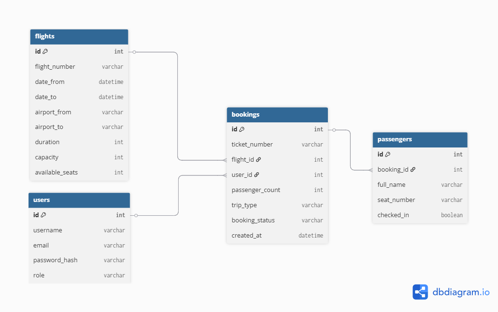
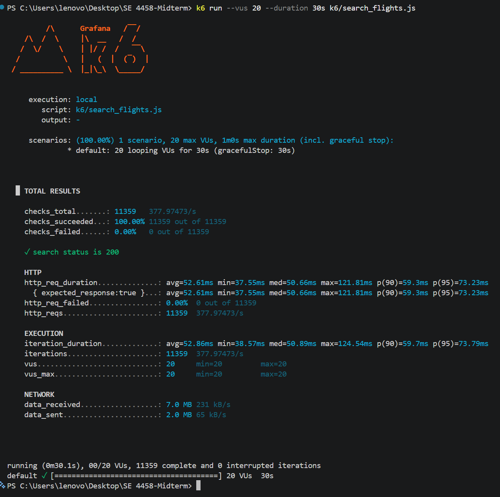
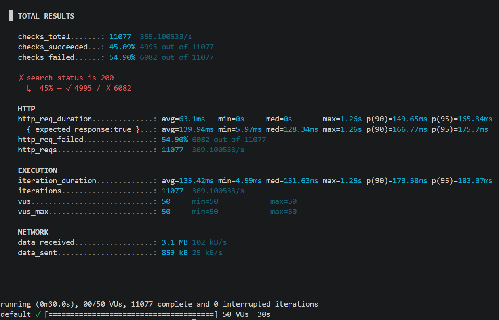
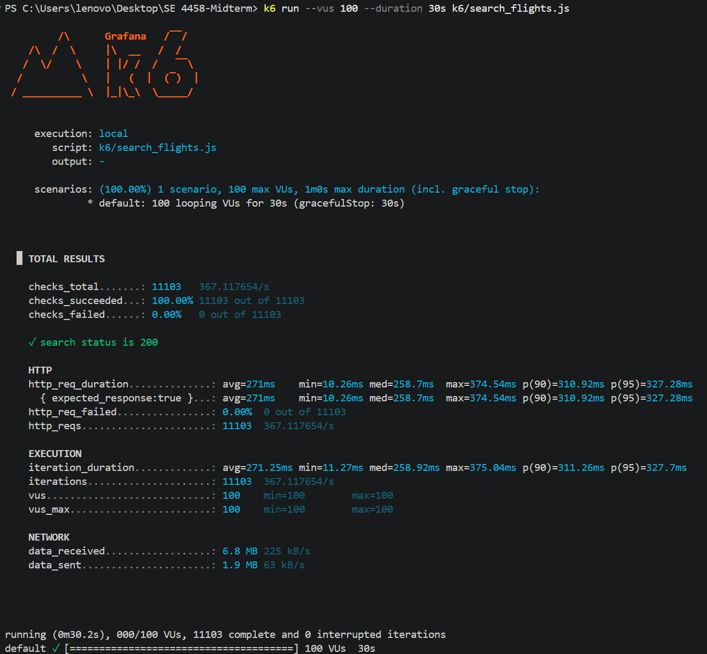
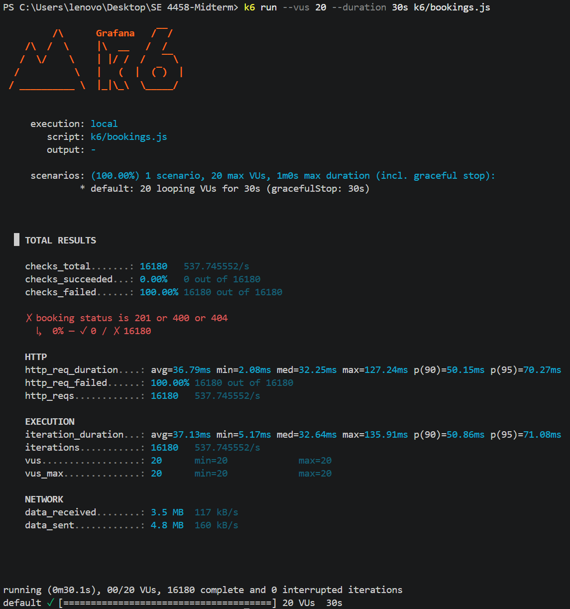
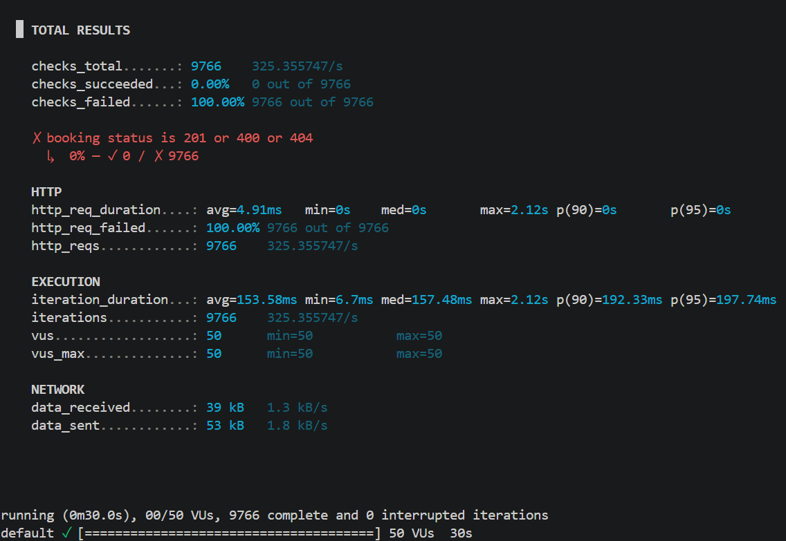
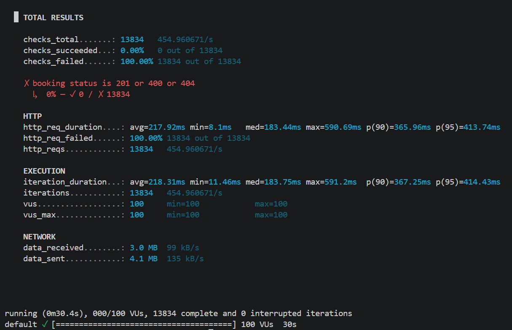

# Airline Ticketing API (Midterm Project)

## Overview

This project implements a RESTful API for an airline ticketing system.
The system allows managing flights, booking tickets, performing check-ins, and retrieving passenger lists.

The API follows:

* Service-oriented architecture
* Versioned REST endpoints
* JWT-based authentication
* Pagination support
* Swagger documentation

---

## Tech Stack

* Python (Flask)
* Flask-RESTX (Swagger UI)
* SQLAlchemy (ORM)
* SQLite (development) / PostgreSQL (production-ready)
* Flask-JWT-Extended (Authentication)
* Flask-Limiter (Rate limiting)

---

## API Base URL

```
/api/v1/
```

Swagger UI:

```
/swagger
```

---

## Authentication

JWT-based authentication is used.

### Login

```
POST /api/v1/auth/login
```

Include token in requests:

```
Authorization: Bearer <your_token>
```

---

## API Endpoints

### 1. Add Flight

```
POST /api/v1/flights
```

* Authentication: YES (admin only)
* Paging: NO
* Description: Adds a new flight to the system

---

### 2. Add Flight by File

```
POST /api/v1/flights/upload
```

* Authentication: YES (admin only)
* Paging: NO
* Description: Upload a CSV file and add multiple flights

---

### 3. Query Flights

```
GET /api/v1/flights/search
```

* Authentication: NO
* Paging: YES (max 10)
* Rate Limit: 3 requests per day
* Description:

  * Returns available flights
  * Flights with insufficient seats are not listed

---

### 4. Buy Ticket

```
POST /api/v1/bookings
```

* Authentication: YES
* Paging: NO
* Description:

  * Book a ticket for passengers
  * Decreases flight capacity
  * Returns ticket number
  * Returns "Sold out" if no seats are available

---

### 5. Check-in

```
POST /api/v1/checkin
```

* Authentication: NO
* Paging: NO
* Description:

  * Assigns seat number to passenger
  * Simple seat numbering (1, 2, 3, ...)

---

### 6. Query Flight Passenger List

```
GET /api/v1/passengers
```

* Authentication: YES
* Paging: YES (max 10)
* Description:

  * Returns passengers and seat numbers for a flight

---

## Data Model (ER Description)

### User

* id
* username
* email
* password_hash
* role

### Flight

* id
* flight_number
* date_from
* date_to
* airport_from
* airport_to
* duration
* capacity
* available_seats

### Booking

* id
* ticket_number
* flight_id
* user_id
* passenger_count
* trip_type

### Passenger

* id
* booking_id
* full_name
* seat_number
* checked_in

---

## Relationships

* One User → Many Bookings
* One Flight → Many Bookings
* One Booking → Many Passengers

## ER Diagram



---

## Assumptions

* A flight is uniquely identified by:

  * flight_number + date_from
* Seats are assigned during check-in (not during booking)
* Passenger names are stored as plain text
* Round-trip is treated as metadata only
* Only admin users can:

  * Add flights
  * Upload CSV files
* Query Flight uses date_from as main filter
*The reports of the k6 testing are included in this README, as projects usually have only one

---

## CSV Upload Format

```
flight_number,date_from,date_to,airport_from,airport_to,duration,capacity
TK101,2026-05-01T09:00:00,2026-05-01T10:30:00,IST,ESB,90,120
TK102,2026-05-01T12:00:00,2026-05-01T13:15:00,IST,ADB,75,80
```

---

## Pagination

```
?page=1&per_page=10
```

Rules:

* Default page = 1
* Maximum per_page = 10

---

## Rate Limiting

* Query Flights endpoint:

  * Limited to 3 requests per day

* Implemented using Flask-Limiter

* For load testing purposes, the limiter was temporarily disabled and re-enabled afterward

---

## 📈 Load Testing

### Tested Endpoints

* GET /api/v1/flights/search
* POST /api/v1/bookings

---

### Test Setup

Load testing was performed using **k6**.

Each test ran for **30 seconds** under:

* Normal Load → 20 users
* Peak Load → 50 users
* Stress Load → 100 users

---

### Results

#### Flight Search Endpoint

| Load Type | Users | Avg (ms) | p95 (ms) | Req/sec | Error Rate |
| --------- | ----- | -------- | -------- | ------- | ---------- |
| Normal    | 20    | 52.61    | 73.23    | 377     | 0%         |
| Peak      | 50    | 63.10*   | 165.34   | 369     | 54.9%      |
| Stress    | 100   | 271.00   | 327.28   | 367     | 0%         |

* Note: Under peak load, a high error rate was observed due to intermittent request failures.

---

#### Booking Endpoint

| Load Type | Users | Avg (ms) | p95 (ms) | Req/sec | Error Rate |
| --------- | ----- | -------- | -------- | ------- | ---------- |
| Normal    | 20    | 36.79    | 70.27    | 537     | 100%       |
| Peak      | 50    | 153.58   | 197.74   | 325     | 100%       |
| Stress    | 100   | 217.92   | 413.74   | 454     | 100%       |

---

### Screenshots

#### Search Endpoint





#### Booking Endpoint





---

## Test Scripts

Scripts are located in the `/k6` directory:

- k6/search_flights.js  
- k6/bookings.js  

---

### Search Flights Script

```javascript
import http from 'k6/http';
import { check } from 'k6';

export default function () {
  const res = http.get(
    'http://127.0.0.1:5000/api/v1/flights/search?date_from=2026-05-01&airport_from=IST&airport_to=ESB&people=1&page=1&per_page=10'
  );

  check(res, {
    'search status is 200': (r) => r.status === 200,
  });
}
```

---

### Booking Script

```javascript
import http from 'k6/http';
import { check } from 'k6';

export default function () {
  const payload = JSON.stringify({
    flight_number: 'TK999',
    date: '2026-05-01',
    passenger_names: ['Test User'],
    trip_type: 'one_way',
  });

  const params = {
    headers: {
      'Content-Type': 'application/json',
      Authorization: 'Bearer YOUR_JWT_TOKEN',
    },
  };

  const res = http.post(
    'http://127.0.0.1:5000/api/v1/bookings',
    payload,
    params
  );

  check(res, {
    'booking status is 201 or error': (r) =>
      r.status === 201 || r.status === 400 || r.status === 404,
  });
}
```
---

### Analysis

The Flight Search endpoint performed efficiently under normal load, maintaining low latency and zero errors. Under stress load, response times increased significantly but the system remained stable. During peak load, partial failures were observed, indicating possible contention under concurrent access.

The Booking endpoint exhibited high error rates due to business logic constraints such as seat availability under concurrent booking attempts. This reflects realistic system behavior rather than system instability.

Overall, read operations scale well, while write operations are limited by shared resources. Future improvements could include database optimization, caching, and queue-based booking processing for better scalability.

---

## Deployment

The API is deployed using an AWS EC2 instance using Gunicorn and systemd, and the PostgreSQL database is active via the AWS RDS service.

Example Swagger URL:

```
http://<server-ip>/swagger
```

---

## Setup Instructions

Install dependencies:

```
pip install -r requirements.txt
```

Create database:

```
python create_db.py
```

Run the application:

```
python run.py
```

---

## Features Summary

* Flight management
* Bulk flight upload (CSV)
* Flight search with filtering
* Ticket booking system
* Seat assignment
* Passenger tracking
* JWT authentication
* Pagination
* Rate limiting
* Swagger UI

---

## Issues Encountered

- k6 installation on Windows initially failed because of Chocolatey permission and lock-file issues.
- The Query Flight endpoint rate limiter affected load testing, so it was temporarily disabled during testing and re-enabled afterward.
- Concurrent booking requests caused high failure rates because available seats were consumed quickly under load.
- JWT-based testing for the booking endpoint required manual token generation and insertion into the k6 script.
- Markdown formatting for screenshots and test scripts needs cleanup to render correctly in the README.

---

## Notes

* API is versioned (`/api/v1`)
* Designed using service-layer architecture
* Follows REST principles

---

## Submission Links

* GitHub Repository: https://github.com/toprakorman/SE4458_Midterm
* Deployed Swagger URL: http://3.70.216.98:5000/swagger
* Demo Video: https://drive.google.com/file/d/1beSfAI8yosThz6SpCIOoKQej9jRMlHI7/view?usp=sharing
